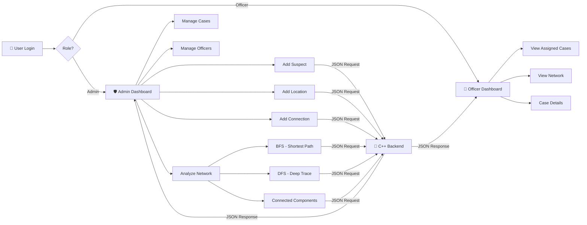

<div align="center">

# 🔍 Crime Network Analyzer

### _Uncover connections. Trace the evidence. Solve the case._

[](https://isocpp.org/)
[](https://www.java.com/)
[](#-dsa-concepts-applied)
[](#)

<br/>


<br/>

> **A desktop crime investigation & analysis system** that models criminal networks as graphs,
> enabling law enforcement to store, connect, and analyze suspects and crime locations
> using core **Data Structures & Algorithms** concepts.

---

[Features](#-features) •
[Architecture](#-system-architecture) •
[DSA Concepts](#-dsa-concepts-applied) •
[Getting Started](#-getting-started) •
[Screenshots](#-screenshots) •
[Project Structure](#-project-structure) •
[Team](#-team)

</div>

---

## 🌟 Features

<table>
<tr>
<td width="50%">

### 🛡️ Authentication & Access Control
- Role-based login (**Admin** / **Officer**)
- Secure credential management via file I/O
- Session-aware UI adapts to user role

### 🕸️ Crime Network Graph
- Add **suspects** with detailed attributes
- Add **crime locations** with metadata
- Create **relationships/connections** between entities
- Adjacency list representation for efficient traversal

</td>
<td width="50%">

### 🔎 Network Analysis
- **BFS** — Find shortest path between suspects
- **DFS** — Trace deep connections in crime chains
- **Graph Traversal** — Discover connected components
- Visual results displayed in-app

### 📁 Case Management
- Hierarchical **case tree** structure
- Assign cases to officers with priority levels
- Track case status (Open/In-Progress/Closed)
- Activity logging for audit trail

</td>
</tr>
</table>

---

## 🏗️ System Architecture

```
┌─────────────────────────────────────────────────────────────────┐
│                    CRIME NETWORK ANALYZER                       │
├─────────────────────────┬───────────────────────────────────────┤
│                         │                                       │
│   ┌─────────────────┐   │   ┌─────────────────────────────┐    │
│   │   Java Swing     │   │   │       C++ Backend            │    │
│   │   Frontend       │   │   │                             │    │
│   │                 │   │   │  ┌─────────┐ ┌───────────┐  │    │
│   │  ┌───────────┐  │   │   │  │  Graph   │ │ Case Tree │  │    │
│   │  │  Login     │  │   │   │  │ (adj.   │ │ (n-ary   │  │    │
│   │  │  Screen    │  │   │   │  │  list)  │ │  tree)   │  │    │
│   │  └───────────┘  │   │   │  └─────────┘ └───────────┘  │    │
│   │  ┌───────────┐  │   │   │  ┌─────────┐ ┌───────────┐  │    │
│   │  │  Admin     │──┼───┼──▶│  │  BFS    │ │   User    │  │    │
│   │  │  Dashboard │  │   │   │  │  Queue  │ │  Manager  │  │    │
│   │  └───────────┘  │   │   │  └─────────┘ └───────────┘  │    │
│   │  ┌───────────┐  │   │   │  ┌─────────┐ ┌───────────┐  │    │
│   │  │  Officer   │──┼───┼──▶│  │  DFS    │ │ Assignment│  │    │
│   │  │  Dashboard │  │   │   │  │  Stack  │ │  Manager  │  │    │
│   │  └───────────┘  │   │   │  └─────────┘ └───────────┘  │    │
│   └─────────────────┘   │   └─────────────────────────────┘    │
│                         │                                       │
│          ◄──── JSON File Exchange (request/response) ────►     │
│                                                                 │
└─────────────────────────────────────────────────────────────────┘
```

### Communication Flow

```
Frontend (Java)                          Backend (C++)
      │                                        │
      │  1. User triggers action               │
      ├──────── Write request.json ────────────►│
      │                                        │  2. Backend detects file
      │                                        │  3. Parses & processes
      │                                        │  4. Executes DSA logic
      │◄──────── Write response.json ──────────┤
      │  5. Frontend reads response            │
      │  6. Updates UI                         │
      ▼                                        ▼
```

---

## 🧠 DSA Concepts Applied

| Data Structure / Algorithm | Implementation | Purpose |
|:---|:---|:---|
| 📊 **Graph** (Adjacency List) | `map<string, vector<pair<string,string>>>` | Model crime network — suspects & locations as nodes, relationships as edges |
| 🔍 **BFS** (Breadth-First Search) | Queue-based level-order traversal | Find **shortest path** between two suspects/locations |
| 🔎 **DFS** (Depth-First Search) | Stack-based deep traversal | Trace **full connection chains** and detect isolated networks |
| 🌳 **N-ary Tree** | `CaseNode` with `vector<CaseNode*>` children | Hierarchical **case management** — cases → evidence, witnesses, suspects |
| 📦 **Queue** | `std::queue` in BFS | Level-by-level network exploration |
| 📚 **Stack** | `std::stack` in DFS | Backtracking during deep graph traversal |
| 🗺️ **Map / HashMap** | `std::map`, `java.util.HashMap` | O(log n) node lookup, user credential storage, attribute mapping |
| 📝 **Vector / Dynamic Array** | `std::vector`, `java.util.ArrayList` | Store edges, assignments, and child nodes |
| 🔗 **Set** | `std::set` | Track visited nodes during traversal to prevent cycles |
| 📂 **File I/O** | `ifstream/ofstream`, `FileReader/FileWriter` | Persistent data storage & inter-process JSON communication |

---

## 🚀 Getting Started

### Prerequisites

| Tool | Version | Purpose |
|:---|:---|:---|
| **g++** | 11+ | Compile the C++ backend |
| **Java JDK** | 8+ | Compile & run the Java frontend |
| **NetBeans** *(optional)* | 12+ | IDE for the Java frontend |

### Installation & Setup

**1. Clone the repository**
```bash
git clone https://github.com/hussnainahmedd/DSA-Project.git
cd DSA-Project
```

**2. Compile & Run the Backend**
```bash
# Compile
g++ "Main Backend" -o backend

# Run (keep this terminal open!)
./backend          # Linux/Mac
backend.exe        # Windows
```

**3. Compile & Run the Frontend**
```bash
# Compile
javac "Main Frontend"

# Run
java CrimeNetworkAnalyzer
```

> [!IMPORTANT]
> **Start the C++ backend first!** The frontend communicates with it via JSON file exchange. If the backend isn't running, you'll see a warning dialog.

### Default Credentials

| Role | Username | Password |
|:---|:---|:---|
| 🔑 Admin | `admin` | `admin123` |
| 👮 Officer | `officer1` | `pass123` |
| 👮 Officer | `officer2` | `pass456` |

---

## 📸 Screenshots

<div align="center">

| Login Screen | Application Dashboard |
|:---:|:---:|
|  |  |

</div>

---

## 📂 Project Structure

```
DSA-Project/
│
├── Main Backend              # 🔧 C++ backend — graph engine, BFS/DFS,
│                             #    user management, case assignment,
│                             #    file-based JSON communication service
│
├── Main Frontend             # 🖥️ Java Swing frontend — login screen,
│                             #    admin/officer dashboards, tabbed UI,
│                             #    network visualization panels
│
├── backend C++               # 📄 Core graph data structure (CrimeGraph class)
│                             #    with adjacency list & node management
│
├── backend c++ 2             # 📄 Case tree implementation (CaseTree class)
│                             #    with n-ary tree for case hierarchy
│
├── frontend java             # 📄 Login screen & JSON helper class
│
├── JSONobject .txt           # 📝 Custom JSON serialization utility (Java)
│
├── Deliverable of Project.docx  # 📋 Project deliverable documentation
│
├── Screenshot *.png          # 🖼️ Application screenshots
│
└── README.md                 # 📖 You are here!
```

---

## 🔄 How It Works



---

## 👨‍💻 Team

<div align="center">

| Contributor | Role |
|:---:|:---:|
| **Hussnain Ahmed** | Developer & Project Lead |

</div>

---

## 📜 License

This project was developed as an **academic assignment** for the **Data Structures & Algorithms (DSA)** course. It is intended for educational purposes.

---

<div align="center">

**⭐ If you found this project helpful, consider giving it a star!**

<br/>

_Built with 💻 C++ · ☕ Java · 🧠 DSA_

</div>
